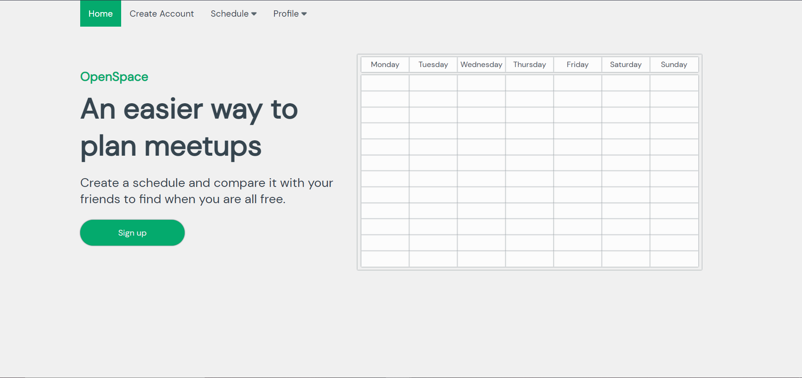

# OpenSpace

Isn't funny how the hardest part of meeting up is typically finding a time when everyone is free?

It doesn't have to be this way.

There are still plenty of improvements that I want to implement, but university has been eating up a lot of my time. 
Once I feel that the app is fully flushed out, I'll deploy it for public use. Stay tuned.

## Features

- Create, delete, and edit tasks/events
- Add friends by acquiring their friend code
- Compare schedules with friends and spot time periods where everyone is free


## Run Locally

Clone the project

```bash
  git clone https://github.com/melhemfares/openspace.git
```

Install dependencies (make sure to do this in both directories)

```bash
  npm install
```
Create .env file and set environment variables

```bash
MONGO_URI=
JWT_SECRET=
JWT_LIFETIME=
```

Run the backend server (terminal #1)

```bash
  cd api -> node app.js
```

Run the client server (terminal #2)

```bash
  cd frontend -> npm run serve
```


## Tech Stack

**Client:** Vue.js, Vuex

**Server:** Node.js, Express

**Database:** MongoDB


## Screenshots



